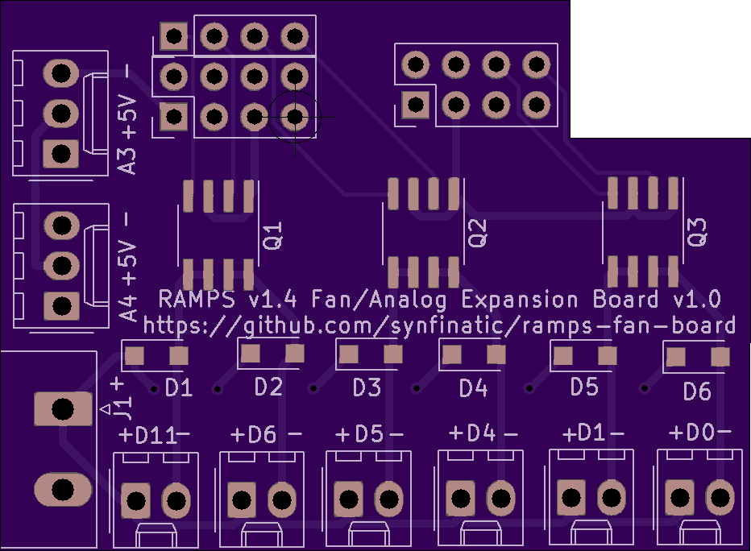
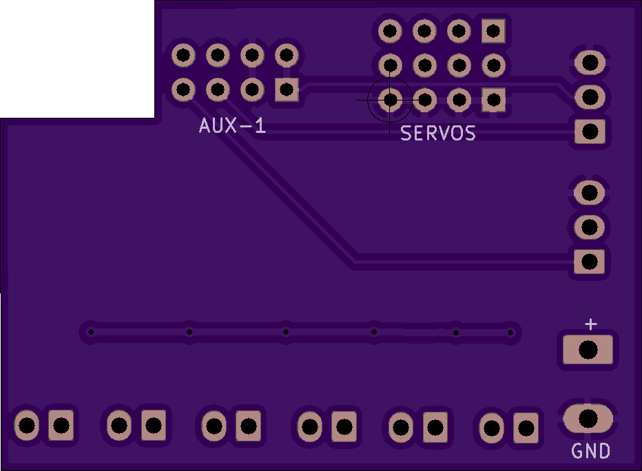
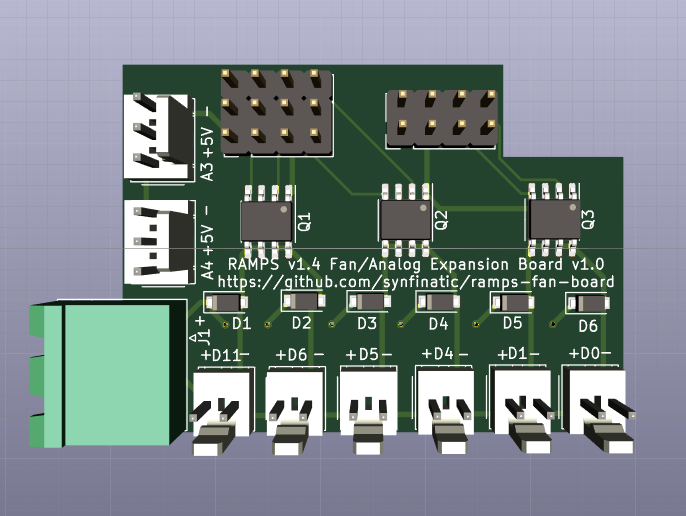

# RAMPS v1.4 Fan and Analog Expansion Board

## What?

This board adds six (6) PWM controlled MOSFETs for controlling fans or LED's
and two analog inputs to your RAMPS v1.4 board.  It takes over the SERVOS and
AUX-1 ports on your RAMPS, leaving AUX-2 and AUX-3 available for other uses.

The board is designed to allow for +5-24V input to power your fans/LEDs/etc 
while the two analog connectors expose +5V from the RAMPS.

## Why?

I have a Flashforge Creator X (Makerbot Replicator 2X clone) with an additional
part cooling fan which I wanted to switch to using a RAMPS setup instead of the
rather outdated Mightyboard running Sailfish.  This printer supports dual extruders
so I wanted additional PWM controlled 24V outputs since the heated build plate and
hot ends would eat the 3 built into the RAMPS board.

Hence my config is:

 - Heated bulid plate: D8
 - E0 hot end: D9
 - E1 hot end: D10
 - E0 fan: D11 *
 - E1 fan: D6 *
 - Part cooling fan: D5 *
 - R channel on RGB Led: D4 *
 - G channel on RGB Led: D1 *
 - B channel on RGB Led: D0 *
 - E0 thermocouple amplifier: A4 *
 - E1 thermocouple amplifier: A3 *

* Notes connections to the expansion board

## Board Images

### Top

### Bottom

### 3D Rendering
(Note the pins for the SERVOS and AUX-1 should be female headers on th _bottom_ of the board!)

